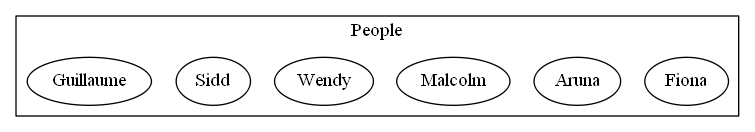
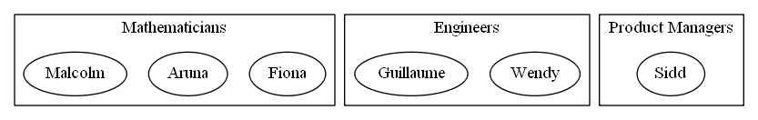
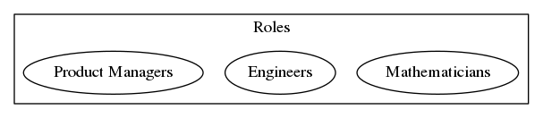

Another attempt to describe things with pictures and informal description.  This time: Partitions.

Partitions are covered in section 1.2.1 of [the book](https://arxiv.org/pdf/1803.05316.pdf).  They're also covered in [Exercise 3](https://forum.azimuthproject.org/discussion/1876/exercise-3-chapter-1#latest).

## What is a Partition?

John describes it as follows in [this comment](https://forum.azimuthproject.org/discussion/comment/16368/#Comment_16368):

> A partition of a set is a way of writing it as a disjoint union of nonempty subsets.

That's pretty accessible, even for non-mathematicians like me.  We can break it down though, with an example.  Let's take a set of colleagues in some fictitious workplace:

And create a partition based on their roles:

What makes that a partition?  Let's go back to the definition:

> a disjoint union of non-empty subsets

* Each of Product Managers, Engineers and Mathematicians is a non-empty subset
* Each person fits in exactly one subset.  That means both:
    * the subsets are not overlapping - so they're disjoint
    * the original People set can be constructed by joining together the three subsets.  In set theory, "union" just means "join together".

Here's another, alternative definition of a partition drawing on some of the language above.

> A partition of a set is a way of splitting the set members into separate subgroups such that:

> 1. Every member of the set is contained in exactly on group, and
> 1. Every group contains at least one member

### What about the definition in the book?

Partitions are defined in definition 1.8 in the book:

> If \\(A\\) is a set, a *partition* of \\(A\\) consists of a set \\(P\\) and, for each \\(p \in P\\), non-empty subset \\(A_p \ss A\\), such that:

$$ A=\bigcup_{p\in P}A_p \qquad\text{and}\qquad  \text{if }p\neq q\text{ then }A_P\cap A_Q=\emptyset $$

That seems a bit different, so let's break it down.  First, it introduces a new set \\(P\\) with members (\\p\\).  In our example above, P is the set of roles, as follows:

